# Capturing and Visualizing Metrics inside a Multi-Tenant SaaS Application

## Introduction
In a Multi-tenant environment, metrics allows you to track, aggregate, and analyze tenant activity. Metrics are the lifeblood of a Software-as-a-Service (SaaS) application, driving both the business and technical aspects of SaaS. This repository contains code to setup a reference implementation of a metrics & analytics solution, which can be used to visualize the usage and consumption across various tenants, and tenant tiers, within your SaaS application. These metrics can then be used for various purposes, such as optimizing tenant experience and ultimately calculating cost per tenant. These metrics will also eventually have a direct impact on the pricing and tiering strategy of your SaaS application.

## Architecture
Below diagram depicts the architecture of this solution. In this case, <b>"Metric producer"</b> is your SaaS application. It is the responsibility of your SaaS Application to produce tenant level metrics. Later in this document, we will also demonstrate a sample client to generate some sample metrics for us and a recommended JSON structure to compose the metric record, along with tenant information. Finally, we will also look at some of the graphs, created using Amazon QuickSight, to analyze these multi-tenant metrics.

The architecture below allows the SaaS application to send metrics to a Kinesis Firehose delivery stream. The stream then ingests these metrics into an Amazon Redshift table. The table has been designed to capture tenant level information. Finally, QuickSight has been used to visualize these metrics at various levels.

<p align="center"><kbd>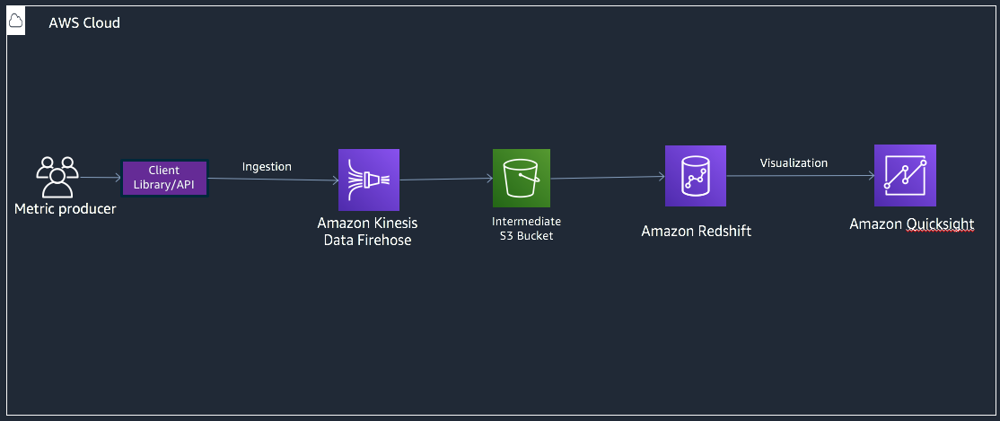</kbd></p>

## Prerequisites to deploy and run the solution
You need an AWS Account in order to deploy the CloudFormation stack associated with this architecture. In order to test the stack and generate few sample metrics record, we have created a sample client using Python. You will need Python 3.7 or above installed on your machine, to run this client. Alternatively, you can use AWS Cloud9 to clone this repository and run this sample client from inside your Cloud9 terminal.

## Deployment Steps
### 1. Deploy the VPC and Subnets (Optional) 
You would need a VPC with 2 Public Subnets to deploy this solution. You can ignore this step, if you already have a VPC which meets these requirements AND want to use that VPC to deploy the infrastructure. Otherwise, deploy the CloudFormation stack, named <b>"1_optional-metrics-vpc.template"</b> residing inside the <b>"deploy"</b> folder of this repository.

The easiest way to deploy would be to use the <b>"CloudFormation"</b> service inside the <b>AWS Console</b>. As shown below, you will be asked to provide the value for 2nd Octet. Provide that parameter and click on "Next". You can leave rest of the values as default in the following screens and then finally click on <b>"Create Stack"</b>.

<p align="center"><kbd>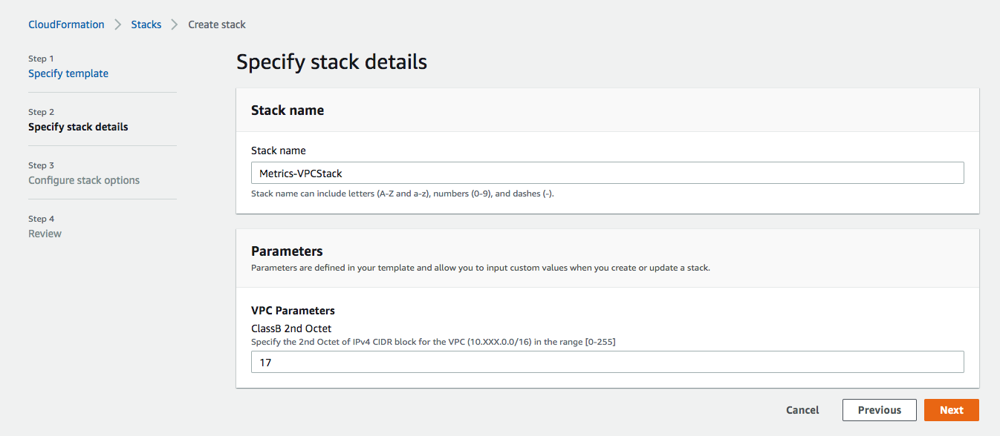</kbd></p>


### 2. Deploy the Metrics & Analytics Architecture
Use <b>"2_metrics-analytics.template.yaml"</b> file, inside the <b>"deploy"</b> folder, to deploy the architecture used for this solution. This template will deploy below infrastructure inside your AWS Account.

* A Redshift delivery stream to accept the incoming metrics and ingest them into a Redshift Cluster, along with corresponding CloudWatch Log Group and Log Stream.
* A Redshift cluster inside the VPC and spanned across 2 Public Subnets selected. You need Redshift to be deployed in public subnet in order to use it with Kinesis Firehose.
* Security group for Redshift, which only allow ingress from Firehose and QuickSight IP Addresses.
* An S3 bucket needed for Firehose to ingest data into Redshift. We have set a lifecycle policy on this S3 bucket, to expire the temporary/intermediate metrics data stored in them after 7 days.
* Encryption Key inside KMS to encrypt data within Firehose and S3.

Below screen shots captures the parameters used by the CloudFormation, while deploying this stack inside AWS console. 

Each parameter has a description related to its usage in the architecture. You will have to select the VPC and Subnets where you want to deploy the Redshift cluster. If you deployed the VPC using the Step 1, then this will be the VPC and Subnet from the previous step. You can choose to Encrypt data at rest, if you are concerned about security of the data. Most of the other parameters have been defaulted and can be modified, as per your needs. One parameter that needs to be provided is the Password for your Redshift Cluster. Make sure to note down the "Master user name" and "Master user password", as you would need this to access your Cluster.

<p align="center"><kbd>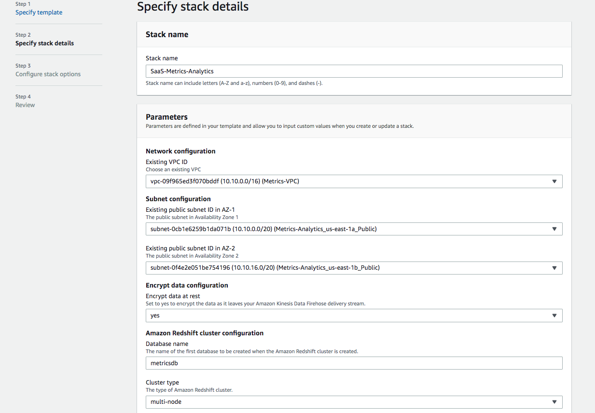</kbd></p>
<p align="center"><kbd>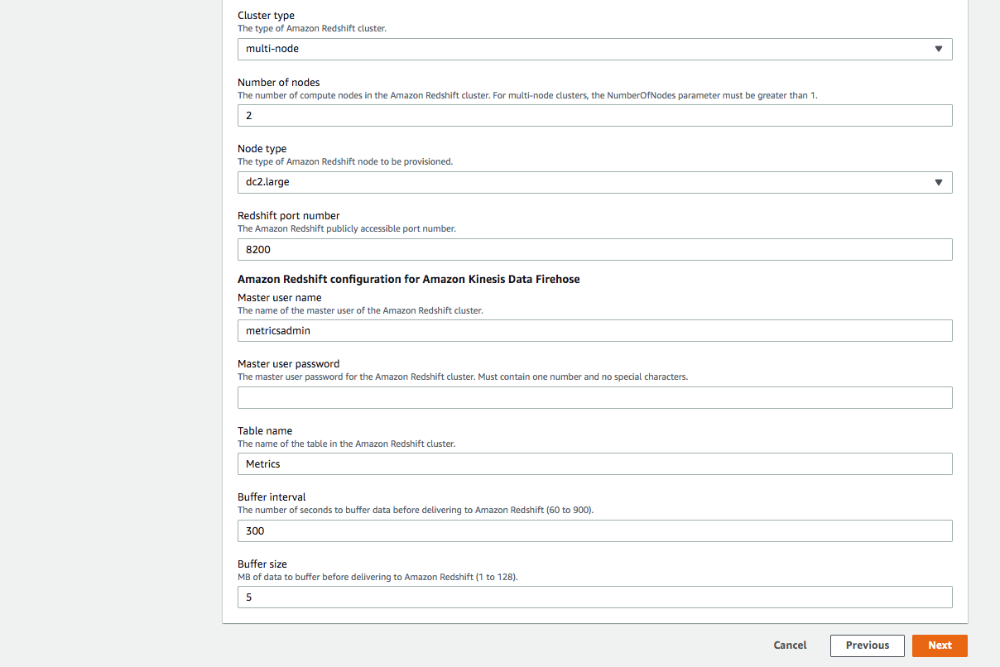</kbd></p>

Click on Next, once you have provided all the parameters. You can leave rest of the values as default in the following screens and then finally click on <b>"Create Stack"</b>. 

### 3. Create the Metrics Table inside Redshift
We will now deploy the Metrics table inside the newly created Redshift Cluster. The table definition is saved inside <b>"3_metrics.sql"</b> file, in the <b>"deploy"</b> folder. To deploy this table, navigate to the Amazon Redshift Console and select <b>"EDITOR"</b> menu from the side bar on the left. Then login into the newly created cluster, using the username and password provided while deploying the CloudFormation. You can then use the query editor to deploy the "metrics" table.

<p align="center"><kbd>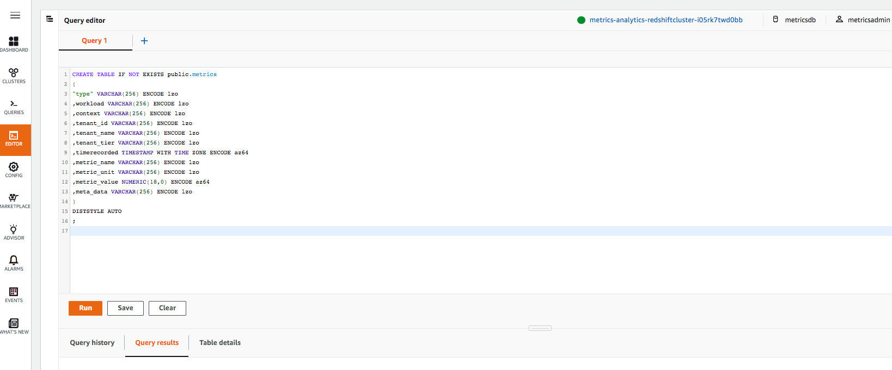</kbd></p>

### 4. Setup Amazon QuickSight
We have used Amazon QuickSight to visualize the metrics data. In order to use QuickSight, you will first need to register for QuickSight inside your AWS Account. If you haven't done this before, follow the instructions provided using this link in order to proceed: https://docs.aws.amazon.com/QuickSight/latest/user/setup-QuickSight-for-existing-aws-account.html

Make sure to allow QuickSight to access Redshift, while signing up. Alternatively, you can do that inside QuickSight using following steps:
* Click on the top right corner where your username is displayed.
* Click Manage QuickSight.
* Click on Security and Permissions.
* Under "QuickSight access to AWS services" section click "Add or remove" button.
* Select "Amazon Redshift" from the list.
* Click Update.

<p align="center"><kbd>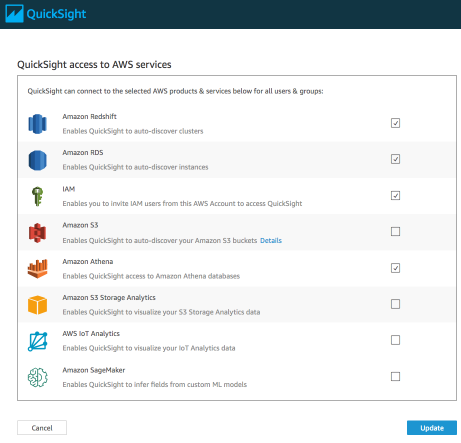</kbd></p>

### 5. Deploy S3 artifacts and create Redshift connection inside QuickSight
Redshift uses a "JSONPaths" file to map JSON columns to the Table. Since we are sending JSON data to Firehose, we need this file, so that Firehose can use it to map JSON columns to "metrics" table. Finally, we also need to setup a Data Source and Data Set inside QuickSight, which can be used to connect to the Redshift cluster. We will use <b>"4_setup-s3-QuickSight.py"</b> file, inside the <b>"deploy"</b> folder, to perform these two actions.

```
python3 4_setup-s3-QuickSight.py 
```
<p align="center"><kbd>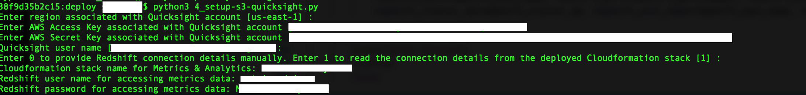</kbd></p>

You will be asked to provide 8 inputs, each with appropriate defaults.

<b>"Enter region associated with QuickSight account"</b> - Defaulted to the current session. Use this to provide the region where you have deployed your CloudFormation stack and registered your QuickSight account. <br>
<b>"Enter AWS Access Key associated with QuickSight account"</b> - Defaulted to the current session. Use this to provide the Access Key to access the deployed CloudFormation stack and QuickSight account.<br>
<b>"Enter AWS Secret Key associated with QuickSight account"</b> - Defaulted to the current session. Use this to provide the Secret Key to access the deployed CloudFormation stack and QuickSight account.<br>
<b>"QuickSight user name"</b> - Defaulted to the QuickSight user created, while registering for QuickSight. You can leave to default value, unless you want another user to have access to the QuickSight Data source and Data set.<br>
<b>"Enter 0 to provide Redshift connection details manually. Enter 1 to read the connection details from the deployed Cloudformation stack"</b> - Leave it to 1, unless you want to specify all the Cluster details manually. <br>
<b>"Cloudformation stack name for Metrics & Analytics"</b> - Stack name for the deployed architecture. We will get the Outputs from this stack and use it to setup Redshift connection inside QuickSight.<br>
<b>"Redshift user name for accessing metrics data"</b> - Username for the Redshift Cluster.<br>
<b>"Redshift password for accessing metrics data"</b> - Password for the Redshift Cluster.<br>

This completes the deployment of the Architecture and all the associated components. 

## Generating sample metrics
Before we generate some sample metrics, it is important to understand the structure of the multi-tenant JSON. This JSON structure directly correlates to the table that we created above inside Redshift. Below is an example JSON .
```json
{
        "type": "Application",  						
        "workload": "PhotoApplication", 				
        "context": "PhotoUploadService", 			    
        "tenant": {							            
                        "id": "tenant-id-1", 
                        "name": "tenant-name-a", 
                        "tier": "standard"
                }, 
        "metric": {					 		            
                        "name": "DataTransfer", 
                        "unit": "MB", 
                        "value": 810
                }, 
        "timestamp": "1593734382", 			
        "metadata": {                                   
                "user": "user-4", 
                "resource": "load-balancer”
                }
                		
}
```
Here is the description for each element of this JSON.
- <b>"type":</b> This is defaulted to "Application" in our case. But, in case you want to extend the usage of this architecture to ingest system level metrics or business KPIs, then you can choose to add "System" or "KPI" as a type, as well.
- <b>"workload":</b> A workload is a collection of resources and code that delivers business value, such as a customer-facing application or a backend process. This could be your SaaS application. In some case, you might have multiple SaaS Applications, being delivered to same set of tenants. Adding this attribute allows us to aggregate metrics from multiple applications into a single place.
- <b>"context"</b>: This is to capture a feature inside your SaaS application. You might allow tenants to sign-up for multiple features based upon their tiers and want to capture the usage across these features.
- <b>"tenant"</b>: This is basically your tenant information. We have de-normalized this entity a bit and passing the tenant_id, tenant_name and tenant_tier as part of the JSON.
- <b>"metric"</b>: This is your actual metric information. Above, we have shown "DataTransfer" as an example. Our sample metric generator have few more examples, like "Storage" and "ExecutionTime". It is up to the product owners and architects of the SaaS application to decide, what relevant metrics they want to capture to understand the tenant consumption patterns.
- <b>"timestamp"</b> - This denotes the time when the metric was recorded.
- <b>"metadata"</b> - This could be used to send any other key-value pair which can provide useful information about the tenant and/or metric. In above example, we are providing the actual user information and the resource for which this metric is relevant. But the implementation of this attribute can vary significantly, based upon the use case. 

Let's now use our sample metrics generator to generate some sample metrics.

```
cd metrics-generator
python3 application-metrics-generator.py
```
<p align="center"><kbd></kbd></p>

You will be asked to provide 8 inputs, each with appropriate defaults.

<b>"How many metrics?"</b> - Number of sample metrics to be generated.<br>
<b>"Enter start date for metrics?"</b> - Start date of the first metric record.<br>
<b>"Number of days?"</b> - For how many days you want the metrics to be spread out, starting from "Start Date". <br>
<b>"Batch size for Kinesis?"</b> - The sample metrics generator send records to Kinesis in batches to improve performance. This parameter controls the batch size. <br>
<b>"Enter region for the deployed metrics stack "</b> - Defaulted to the current session. Use this to provide the region where you have deployed your CloudFormation stack. <br>
<b>"Enter AWS Access Key for the deployed metrics stack"</b> - Defaulted to the current session. Use this to provide the Access Key to access the deployed CloudFormation stack.<br>
<b>"Enter AWS Secret Key for the deployed metrics stack"</b> - Defaulted to the current session. Use this to provide the Secret Key to access the deployed CloudFormation stack.<br>
<b>"Enter Kinesis stream name"</b> - This will default to the deployed Kinesis Delivery Stream. You can change if needed.<br>

This will now push the metrics records to Kinesis Firehose, which will then ingest it to Redshift. Depending upon the Buffer interval and Buffer size you provided, while deploying the stack, it can take anywhere between 60 to 900 seconds (1 to 15 mins) to show up the records in Redshift. This is because Kinesis keeps those records in its memory and only send to Redshift, once it hits the Buffer interval or Buffer size. 

You can now start exploring the metric data inside Redshift, using the Query Editor.

## Example Java SDK to send metrics from your SaaS Application
Your goal should be to use a standard way to send metric data, inside your SaaS Application. To demonstrate this, this code repository comes with a sample Java SDK to ingest data into Kinesis Firehose. You can refer to this Java SDK, as a reference implementation, to understand how your SaaS application can potentially send metrics data to the deployed architecture.

This SDK uses maven. For building the artifacts use the following commands. 
```
cd metrics-java-sdk
mvn clean install
```
This will install the artifact into your local maven repository.

Assuming your SaaS Application is written in Java, use the following snippet to import the artifact as a dependency.
```
<dependency>
            <groupId>com.amazonaws.saas</groupId>
            <artifactId>metrics-java-sdk</artifactId>
            <version>1.0-SNAPSHOT</version>
</dependency>
```

Sample Java code to send the metric:
```
MetricEventLogger logger = MetricEventLogger.getLoggerFor("STREAM_NAME", Region.US_EAST_1);
MetricEvent event = new MetricEventBuilder()
        .withType(MetricEvent.Type.Application)
        .withWorkload("AuthApp")
        .withContext("Login")
        .withMetric(new MetricBuilder()
                .withName("ExecutionTime")
                .withUnit("msec")
                .withValue(1000L)
                .build()
        )
        .withTenant(new TenantBuilder()
                .withId("123")
                .withName("ABC")
                .withTier("Free")
                .build())
        .addMetaData("user", "111")
        .addMetaData("resource", "s3")
        .build();
logger.log(event);
```

You can refer this SDK to come up with sample implementations in other programming languages, depending upon your use case.

## Sample Multi-Tenant Dashboard
Till now we have deployed the architecture, setup QuickSight and sent some sample data to the deployed stack. Now comes the most important part of visualizing the data, using QuickSight. This is what the business and technical owners of your SaaS application will use to see tenant level trends and make some of the important decisions.

As of now, QuickSight doesn't allow you to create graphs using APIs. Because of this limitation, this Architecture doesn't come with any pre-built/canned graphs to visualize some of those tenant level metrics. But below are some of the screen shots of few sample graphs that you can create using the Data source and Data set created, as part of the deployment above.

In this case, we have created a QuickSight Dashboard with four tabs, namely "System Usage", "Top N Features", "Metrics Per User" and "Raw Metrics"

#### System Usage
This is by far the most important Tab and presents lots of useful information about your SaaS application's usage and consumption. Assume you have a SaaS Application(s), comprising of more than one workload, which provides Data Storage services to your tenants. Let's take below few use cases, as an example, to demonstrate how you can visualize your metrics data in this scenario.

1) You might want to know how much Storage is being used by across your SaaS Applications/Workloads.
2) You might want to know how much Storage is being used by each feature with-in each SaaS Application/Workload.
3) Your tenants are categorized into tiers (free, basic, standard, premier) and you want to know how much storage is consumed across these tiers.
4) You want to know the consumption at tenant level to see your busy tenants.
5) You want to see overall Storage by Date.
6) You want to see overall Storage by Date and Tier.

Above are few examples and the way metrics will be visualized depends on the use case of the SaaS Application. You can also use the consumption per tenant metrics to apportion the overall system usage by tenant. If your pricing model depends on the actual consumption, this is a useful metrics used to bill your tenant.

Here are some of the screenshots demonstrating these use cases.

<p align="center"><kbd>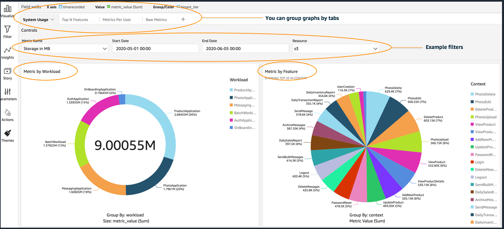</kbd></p>

<p align="center"><kbd>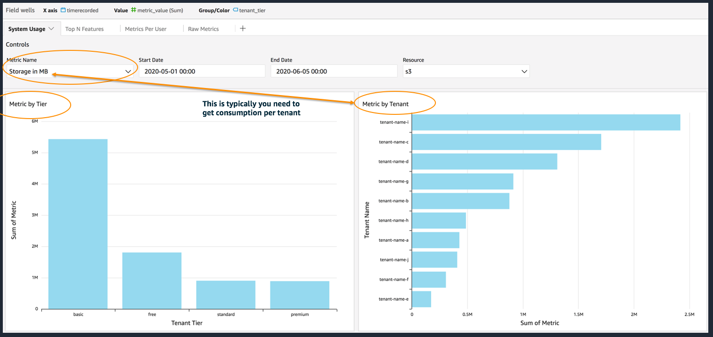</kbd></p>

<p align="center"><kbd>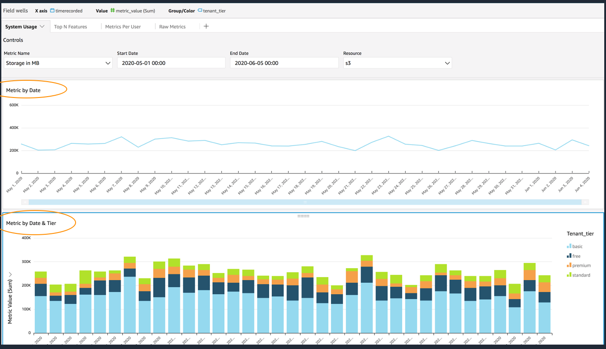</kbd></p>

#### Top N Features
This tab is used for visualizing your top used features by tenants and tenant tiers.

<p align="center"><kbd>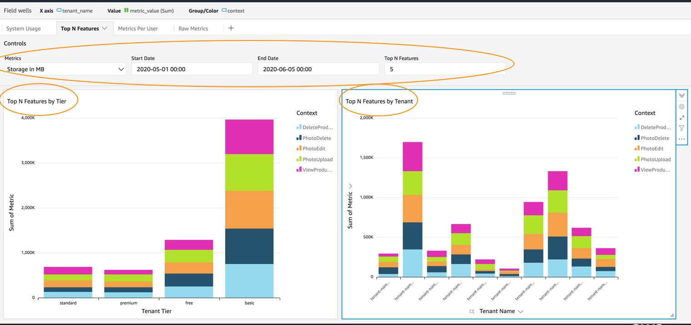</kbd></p>

#### Metrics Per User
In some cases, you might want to know which user is consuming most within a tenant. Below screenshot uses the "user" attribute inside "meta_data" attribute of the JSON. Here we have created a calculated field inside QuickSight Dataset, something like this: 

<p align="center"><kbd>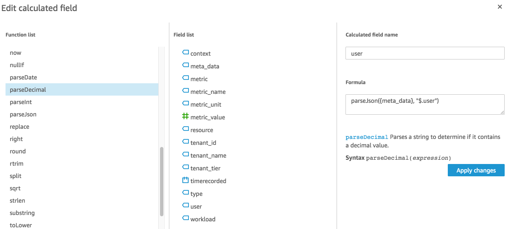</kbd></p>

Below is the Metrics per user graph.
<p align="center"><kbd>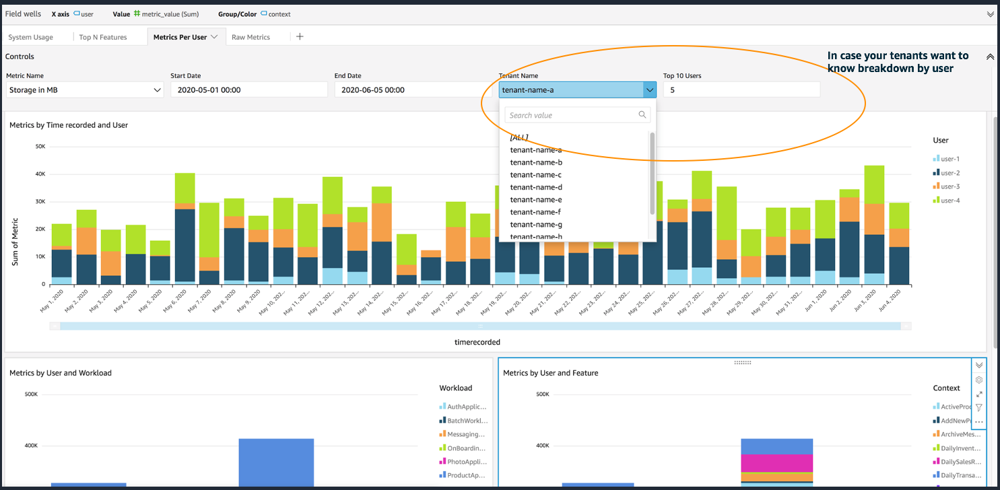</kbd></p>

#### Raw Metrics
Below screenshot, shows the Raw view of Metrics in a table format. 

<p align="center"><kbd>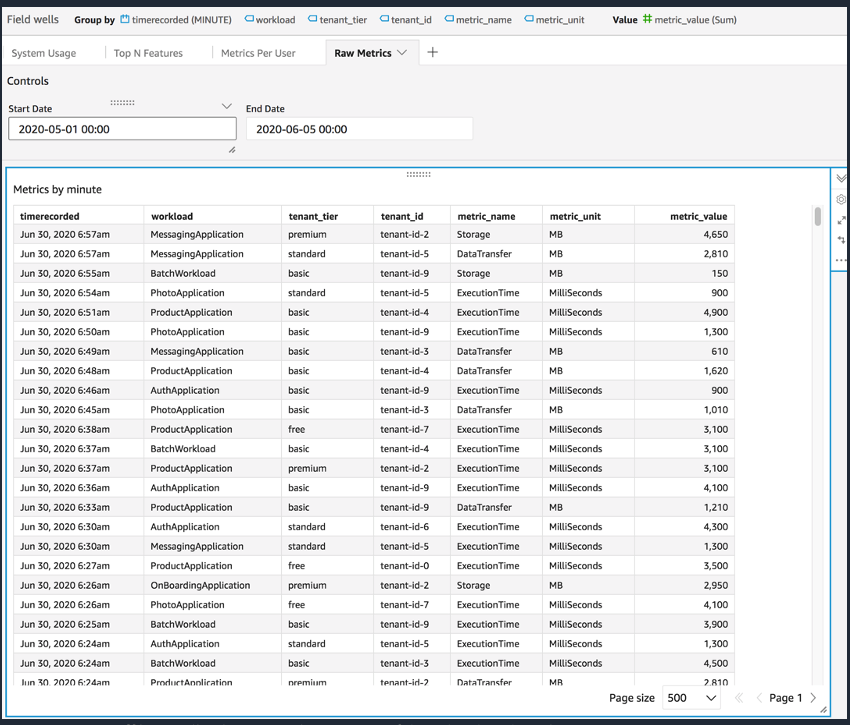</kbd></p>

## Steps to Clean-up
Use the below steps to perform clean-up in your account:
1. Delete the CloudFormation stacks used to create the VPC and subnets and then the CloudFormation stack for the Metrics & Analytics architecture, using the CloudFormation console. 
2. Delete the S3 Bucket created to store the intermediate Redshift files and JSONPath file, using S3 Console.
3. If you want to close your QuickSight account, you can do so by following instructions in this link: https://docs.aws.amazon.com/QuickSight/latest/user/closing-account.html
4. But if want to keep the QuickSight account, they you can just delete the corresponding Dashboard, Data source and Data set created to visualize the metrics data.<br>
    a) https://docs.aws.amazon.com/QuickSight/latest/user/deleting-a-dashboard.html<br>
    b) https://docs.aws.amazon.com/QuickSight/latest/user/delete-a-data-set.html<br>
    c) https://docs.aws.amazon.com/QuickSight/latest/user/delete-a-data-source.html    
     

## Security

See [CONTRIBUTING](CONTRIBUTING.md#security-issue-notifications) for more information.

## License

This library is licensed under the MIT-0 License. See the LICENSE file.

